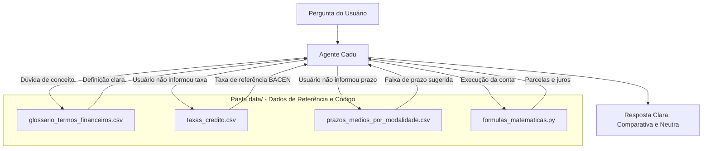

# 📚 Base de Conhecimento: Cadu
## 1. Dados Utilizados e Estrutura de Arquivos
Todos os arquivos que compõem a base de conhecimento do **Cadu** estão localizados na pasta `data/` do repositório, combinando dados tabulares de referência e código determinístico para execução de cálculos:
| Arquivo | Formato | Origem / Ferramenta | Finalidade no Agente |
| :--- | :---: | :--- | :--- |
| `data/glossario_termos_financeiros.csv` | CSV | Curadoria estruturada no **NotebookLM** com base em fontes oficiais (BACEN, CFP, FSA, Caixa e FGV). | Padronizar definições didáticas e acessíveis de conceitos financeiros (Price, SAC, CET, IOF, Amortização, etc.). |
| `data/taxas_credito.csv` | CSV | **Banco Central do Brasil (BACEN).** | Fornecer taxas de juros médias de mercado para balizar simulações quando o usuário **não fornece uma taxa de juros**. |
| `data/prazos_medios_por_modalidade.csv` | CSV | Estruturado via **Google Gemini**. | Consultar limites e médias de prazos (mínimo e máximo de parcelas) quando o usuário **não informa o prazo/quantidade de parcelas**. |
| `data/formulas_matematicas.py` | Python | Desenvolvido com apoio do **Microsoft Copilot**. | Módulo com as fórmulas matemáticas financeiras exatas (Tabela Price, juros acumulados, amortização e simulação de entrada). |
---
## 2. Metodologia de Coleta e Curadoria
### A. Glossário de Termos Financeiros (`glossario_termos_financeiros.csv`)
Elaborado utilizando o **NotebookLM** como ferramenta de sintetização e curadoria a partir de 5 referências de alta credibilidade:
1. **Banco Central do Brasil (BACEN):** [*Glossário Simplificado de Cidadania Financeira*](https://www.bcb.gov.br/content/cidadaniafinanceira/documentos_cidadania/Informacoes_gerais/glossario_cidadania_financeira.pdf) 
2. **Conselho das Finanças Públicas (CFP):** [*Glossário do CFP*](https://www.cfp.pt/pt/glossario/administracao-central)
3. **Fundação Santo André (FSA):** [*Top 10 Termos Financeiros para Conhecer*](https://www.fsa.br/termos-financeiros/)
4. **Caixa Econômica Federal:** [*Glossário da Macroeconomia*](https://www.caixa.gov.br/Downloads/aplicacao-financeira-fundos-investimento/Glossario-Macroeconomia-CAIXA.pdf)
5. **FGV:** [*Setores de Regulação: Sistema Financeiro*](https://regulacaoemnumeros-direitorio.fgv.br/sistema-financeiro)
### B. Tabela de Taxas de Juros para Operações de Crédito (`taxas_credito.csv`)
* **Origem:** Extraída da seção de [estatísticas de taxas de juros do Banco Central do Brasil](bcb.gov.br/estatisticas/txjuros) (dados do mês de agosto).
* **Tratamento de Dados:** Os dados brutos foram limpos e formatados para simplificar a leitura computacional pelo agente, servindo como base de referência nas principais modalidades (Empréstimo Pessoal, Consignado, Veículos e Imobiliário).
### C. Prazos Médios por Modalidade (`prazos_medios_por_modalidade.csv`)
* **Origem e Papel:** Tabela estruturada com o auxílio do **Google Gemini** para mapear os prazos usuais praticados pelo mercado financeiro nacional, definindo limites mínimos e máximos recomendados para quando o tomador de crédito não souber qual prazo simular.
---
## 3. Fórmulas Matemáticas (`formulas_matematicas.py`)
Para assegurar que o agente não cometa erros aritméticos em juros compostos ou amortizações, o módulo em Python gerado com apoio do **Microsoft Copilot** encapsula as fórmulas matemáticas utilizadas na área.

---
## 4. Estratégia de Integração dos Dados
O Cadu utiliza uma **arquitetura híbrida** para responder ao usuário:

1. **Injeção de Contexto (Context Injection):** Os arquivos CSV alimentam o agente com definições didáticas e valores padrão de referência (taxas e prazos de mercado).
2. **Execução Determinística de Código (Code Execution):** Os cálculos numéricos são delegados ao módulo `formulas_matematicas.py`, garantindo precisão matemática sem alucinações.
