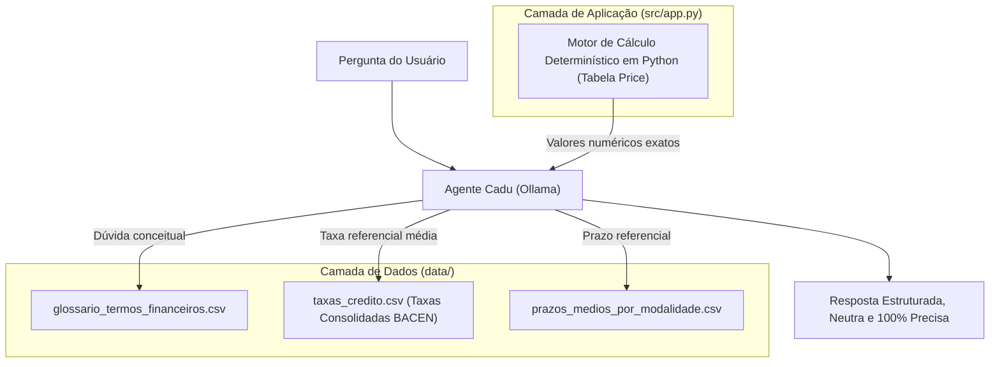

# 📚 Base de Conhecimento: Cadu
## 1. Dados Utilizados e Estrutura de Arquivos
Todos os arquivos que compõem a base de conhecimento do **Cadu** estão localizados na pasta `data/` do repositório, combinando dados tabulares de referência e código determinístico para execução de cálculos:
| Arquivo | Formato | Origem / Ferramenta | Finalidade no Agente |
| :--- | :---: | :--- | :--- |
| `data/glossario_termos_financeiros.csv` | CSV | Curadoria estruturada no **NotebookLM** com base em fontes oficiais (BACEN, CFP, FSA, Caixa e FGV). | Padronizar definições didáticas e acessíveis de conceitos financeiros (Price, SAC, CET, IOF, Amortização, etc.). |
| `data/taxas_credito.csv` | CSV | **Banco Central do Brasil (BACEN).** | Fornecer taxas de juros médias de mercado para balizar simulações quando o usuário **não fornece uma taxa de juros**. |
| `data/prazos_medios_por_modalidade.csv` | CSV | Estruturado via **Google Gemini**. | Consultar limites e médias de prazos (mínimo e máximo de parcelas) quando o usuário **não informa o prazo/quantidade de parcelas**. |

---
## 2. Metodologia de Coleta e Curadoria
### A. Glossário de Termos Financeiros (`glossario_termos_financeiros.csv`)
Elaborado utilizando o **NotebookLM** como ferramenta de sintetização e curadoria a partir de 5 referências de alta credibilidade:
1. **Banco Central do Brasil (BACEN):** [*Glossário Simplificado de Cidadania Financeira*](https://www.bcb.gov.br/content/cidadaniafinanceira/documentos_cidadania/Informacoes_gerais/glossario_cidadania_financeira.pdf) 
2. **Conselho das Finanças Públicas (CFP):** [*Glossário do CFP*](https://www.cfp.pt/pt/glossario/administracao-central)
3. **Fundação Santo André (FSA):** [*Top 10 Termos Financeiros para Conhecer*](https://www.fsa.br/termos-financeiros/)
4. **Caixa Econômica Federal:** [*Glossário da Macroeconomia*](https://www.caixa.gov.br/Downloads/aplicacao-financeira-fundos-investimento/Glossario-Macroeconomia-CAIXA.pdf)
5. **FGV:** [*Setores de Regulação: Sistema Financeiro*](https://regulacaoemnumeros-direitorio.fgv.br/sistema-financeiro)
### B. Tabela de Taxas de Juros para Operações de Crédito (`taxas_credito.csv`)
* **Origem:** Extraída da seção de [estatísticas de taxas de juros do Banco Central do Brasil](bcb.gov.br/estatisticas/txjuros) (dados do mês de agosto de 2026).
* **Tratamento e Consolidação:** Originalmente, a base do BACEN apresentava diversas taxas anuais e mensais segregadas por instituição bancária. Para otimizar a leitura computacional e prover respostas diretas e neutras, a tabela foi simplificada para conter **apenas uma taxa média mensal consolidada por modalidade** (calculada pela média das taxas praticadas pelas instituições financeiras).
### C. Prazos Médios por Modalidade (`prazos_medios_por_modalidade.csv`)
* **Origem e Papel:** Tabela estruturada com o auxílio do **Google Gemini** para mapear os prazos usuais praticados pelo mercado financeiro nacional, definindo limites mínimos e máximos recomendados para quando o tomador de crédito não souber qual prazo simular.
---
## 3. Estratégia de Integração e Separação de Responsabilidades

1. **Injeção de Contexto:** Os arquivos CSV fornecem o conhecimento de apoio e as taxas consolidadas de mercado.
2. **Cálculo Determinístico:** O Python executa a matemática financeira analítica, eliminando alucinações aritméticas do modelo de linguagem.
